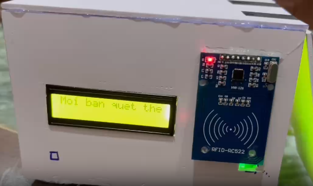
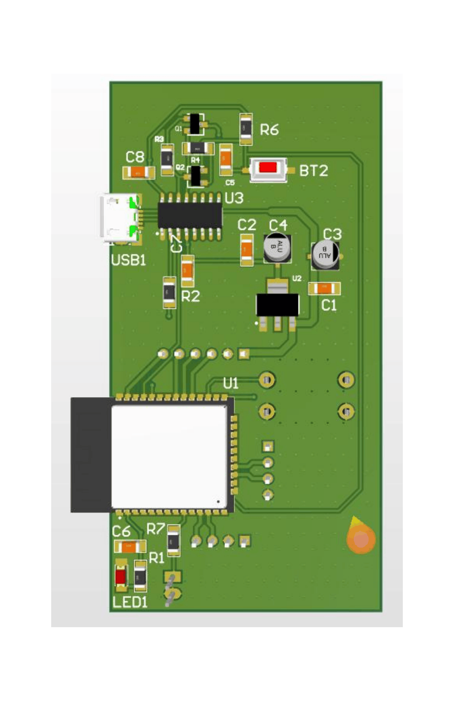
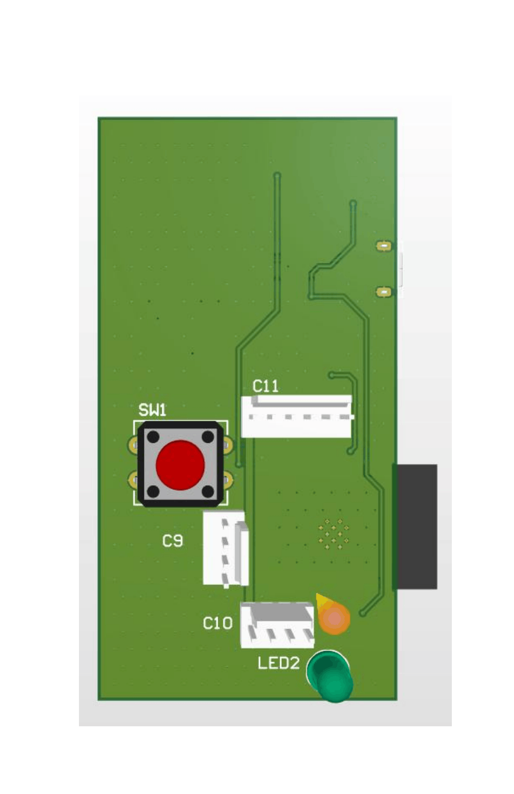
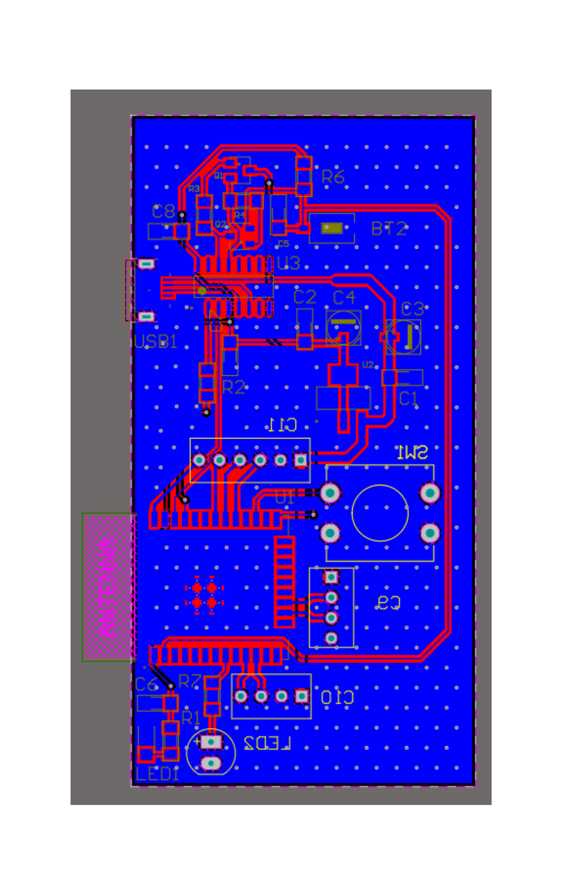
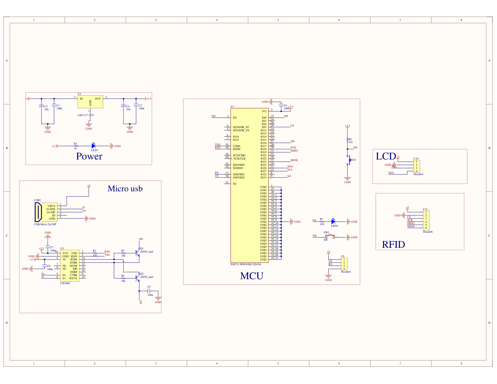

# IoT Attendance System - ESP32 RFID Attendance Logger

## Demo

<div align="center"> <video src="https://github.com/user-attachments/assets/ad45b7ab-8803-4171-bdca-496d715ec5ab" alt="Calculator beta" height=200/> </div>

---

## Documentation

| File | Description |
|---|---|
| [README](README.md) | Main project overview, hardware information, firmware features, and operating principle |
| [layout](./images/layout.pdf) | PCB layout designed using Altium Designer |
| [schematic](./images/schematic.pdf) | Hardware schematic diagram |
| [attendance_system](./attendance_system) | ESP32 firmware source code |
| [attendance_SYS_altium](./attendance_SYS_altium) | PCB and schematic source files |
| [demo video](./demo_IOT_attendance_sys.mp4) | Project demonstration video |

---

## Introduction

This project implements an IoT-based attendance system using the ESP32 microcontroller.

The system scans RFID cards using the RC522 RFID module, records attendance data including Card ID and Timestamp, and uploads the data in real time to Google Sheets for storage and monitoring.

The project demonstrates embedded IoT development concepts including:

- RFID card scanning
- SPI communication
- LCD interfacing via I2C
- Wi-Fi connectivity
- BLE Wi-Fi provisioning
- HTTPS GET request handling
- Google Sheets data logging
- FreeRTOS task management
- PCB design using Altium Designer

---

## Hardware

<table align="center">
  <tr>
    <td align="center">
      
    </td>
  </tr>
</table>

<p align="center">
  <strong><em>Figure 1:</em></strong> ESP32 IoT Attendance System Hardware Prototype
</p>

### Hardware Components

| Component | Description |
|---|---|
| MCU | ESP32 with Wi-Fi and Bluetooth |
| RFID Module | RC522 RFID module using SPI |
| Display | LCD 16x2 using I2C interface |
| Power Supply | External power supply with voltage regulator |
| PCB | Custom PCB designed using Altium Designer |

---

## Features

### Attendance Logging
- Scan RFID cards
- Verify card IDs
- Record attendance timestamp
- Upload attendance data to Google Sheets in real time

### IoT Connectivity
- Wi-Fi connection using ESP32
- Wi-Fi provisioning via BLE
- HTTPS GET request to send attendance data

### Embedded Features
- LCD 16x2 display output
- RFID card reading using RC522
- SPI communication
- I2C communication
- FreeRTOS-based task scheduling
- NTP-based time synchronization

---

## System Operating Principle

The attendance system firmware operates in the following flow:

### 1. RFID Scanning

The RC522 RFID module continuously scans for RFID cards. When a card is detected, the ESP32 reads the card ID through the SPI interface.

### 2. Data Processing

The firmware verifies the scanned card ID and prepares the attendance data, including:

- Card ID
- Timestamp
- Attendance status

### 3. Data Upload

The ESP32 connects to Wi-Fi and sends the attendance data to Google Sheets using an HTTPS GET request.

### 4. Display Update

The LCD 16x2 displays system status such as Wi-Fi connection, card scanning result, and upload status.

---

## PCB Layout

<p align="center">
  
  
  
</p>
<p align="center">
  <strong><em>Figure 2:</em></strong> PCB Layout
</p>

---

## Schematic

<p align="center">
  
</p>

<p align="center">
  <strong><em>Figure 3:</em></strong> Hardware Schematic
</p>

---

## Project Structure

```text
attendance_SYS/
├─ attendance_SYS_altium/        # PCB design and schematic source files
├─ attendance_system/            # ESP32 firmware source code
├─ images/                       # Hardware, PCB layout, and schematic images
├─ README.md                     # Main project documentation
├─ demo_IOT_attendance_sys.mp4   # Demo video
├─ layout.pdf                    # PCB layout PDF
└─ schematic.pdf                 # Schematic PDF
```

---

## Getting Started

1. Install ESP-IDF
2. Open the firmware project in VS Code or ESP-IDF terminal
3. Configure Wi-Fi provisioning and Google Sheets endpoint
4. Build the firmware
5. Flash the firmware to ESP32
6. Open serial monitor and test RFID attendance logging

```bash
git clone https://github.com/MinhQuocNguyenHoang/attendance_SYS.git
cd attendance_SYS/attendance_system
idf.py set-target esp32
idf.py build
idf.py flash monitor
```

---

## Software Environment

| Tool / Framework | Purpose |
|---|---|
| ESP-IDF v5.4.1 | ESP32 firmware development framework |
| Embedded C | Main programming language |
| FreeRTOS | Real-time task scheduling |
| VS Code | Source code editing and development |
| Altium Designer | PCB and schematic design |
| abobija_rc522 | RC522 RFID driver library |
| Google Sheets | Attendance data storage and monitoring |

---

## Testing

| Test Case | Expected Result |
|---|---|
| Scan RFID card | Card ID is detected and displayed |
| Upload attendance data | Data appears in Google Sheets |
| Test Wi-Fi provisioning | Device connects to configured Wi-Fi |
| Restart ESP32 | Device reconnects automatically |
| Check LCD status | LCD displays scan and upload status |

---

## Roadmap / Future Improvements

- Add fingerprint sensor for more secure attendance authentication
- Improve retry and error handling to prevent data loss
- Build a mobile or web dashboard for attendance visualization
- Improve data security with message encryption
- Add OTA firmware update support
- Add local data buffering when Wi-Fi is disconnected

---

<h3>Contact Me</h3>

<p>
  <a href="https://github.com/MinhQuocNguyenHoang">
    
  </a>

  <a href="https://www.linkedin.com/in/minhquoc-hcmus/">
    
  </a>

  <a href="mailto:quoc20053008@gmail.com">
    
  </a>
</p>
